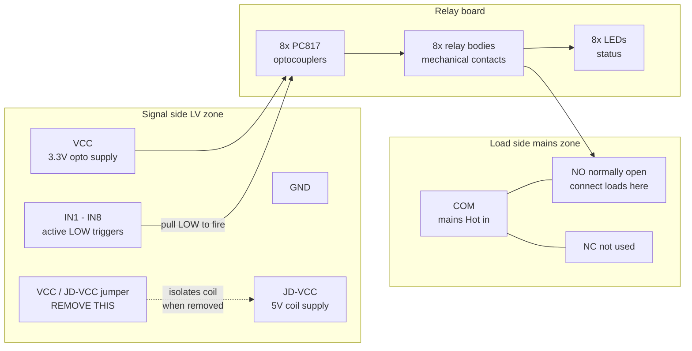
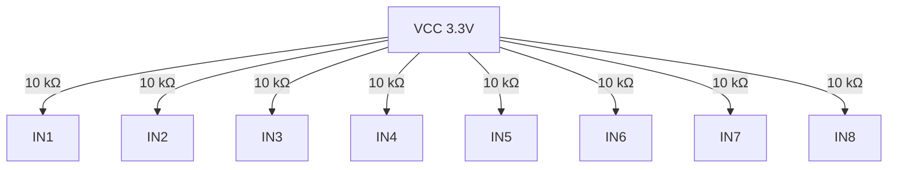

# Chapter 04 — Relay Module Setup

**What you'll do:** Understand the relay board anatomy, remove the VCC/JD-VCC
jumper, verify the board is 3.3V compatible, install pull-up resistors on all 8
IN pins, and mount the board in the enclosure.

**Prerequisites:** Chapter 02 complete (standoffs installed). Relay module,
10 kΩ resistors ×8, soldering iron, solder, multimeter.

> [!NOTE]
> No mains voltage. Bench work only. Do not power the relay board during this chapter.

---

## What Is a Relay?

<strong>[?] Relay:</strong>

A relay is an electrically controlled switch. It has two separate
circuits: a low-voltage "coil" circuit and a high-voltage "contact" circuit.
When a small signal pulls an IN pin LOW, the coil generates a magnetic field that
physically moves a metal arm to close the contact — you'll hear a click. The
contact switches the mains load without any electrical connection between the ESP32
signal and the mains voltage.

<strong>[?] Optocoupler:</strong>

An isolation layer inside the relay board. The ESP32's GPIO
signal drives a small LED inside the optocoupler. Light from that LED activates a
phototransistor on the other side, which drives the relay coil. The ESP32 and the
relay coil never share any electrical path — they communicate via light. This
protects the ESP32 from voltage spikes when inductive loads (fans) switch off.

---

## Relay Board Anatomy

A standard 8-channel opto-isolated relay board has:

Connect the adapter's IN rows to the relay board IN1–IN8 pins with short jumpers,
and its VCC row to the relay board VCC pin.

### Method B — Direct Solder to Header

Solder each 10 kΩ resistor directly between the VCC pin and an IN pin on the signal
header. Trim leads to ~5 mm before soldering to keep them neat.

**Verification after installation:**
1. Resistance mode — VCC to IN1 through IN8: each should read ~8–10 kΩ (the pull-up
   resistor in parallel with the optocoupler input impedance).
2. Between any two adjacent IN pins: should show open circuit (no solder bridge).

**✓ Check:** All 8 pull-up resistors installed. VCC→INx reads ~10 kΩ per channel.
No bridges between IN pins.

---

## Step 4 — Mount the Relay Board

1. Orient the relay board so:
   - **Load terminals (COM/NO/NC) face toward the mains zone**
   - **Signal header (IN1–IN8/VCC/GND) faces the LV zone**
2. Set the board on its M3 standoffs.
3. Secure with M3 screws — firm but not cracking-the-board tight.

**✓ Check:** Relay board mounted securely. Load terminals face mains zone. Signal
header faces LV zone. Board does not touch the enclosure floor.

---

## Chapter 04 Checkpoint

- [ ] VCC/JD-VCC jumper removed; VCC and JD-VCC confirmed open
- [ ] IN pin resistors confirmed ≤ 470 Ω on all channels
- [ ] 10 kΩ pull-up resistors installed on all 8 IN pins
- [ ] Pull-up resistors verified: VCC→INx reads ~10 kΩ per channel
- [ ] No solder bridges between IN pins
- [ ] Relay board mounted on standoffs; load terminals face mains zone

---

[← Ch 03 — Power Supply Installation](03-power-supply-install.md)  ·  [Ch 05 — ESP32-S3 Setup →](05-esp32-s3-setup.md)
