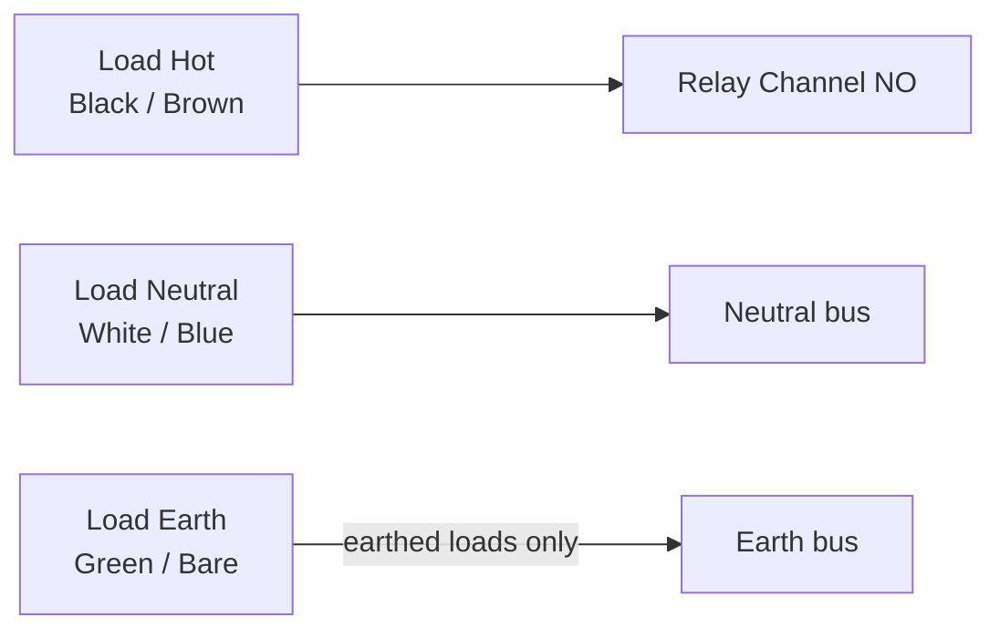

# Chapter 09 — Mains Wiring

**What you'll do:** Connect all line-voltage wiring: mains input through GFCI/RCD
and input fuse to both PSUs; relay COM terminals through the per-load fuse block to
each load; shared neutral bus and earth connections.

**Prerequisites:** Chapters 02–08 complete. All mains-zone components mounted and
labelled (Chapter 03). Wago 221 connectors, 14 AWG wire, 16–18 AWG wire, ferrule
crimp kit, multimeter.

---

## ⚠️ Before You Begin: Mains Safety

> [!CAUTION]
> **Before touching the mains zone, read every item:**
>
> 1. **The enclosure must be unplugged.** Verify physically — look at the wall
>    outlet and confirm the plug is out.
> 2. **If you are not comfortable with mains wiring, have a licensed electrician
>    do this chapter.** Everything in Chapters 02–08 and 10–12 is low-voltage and
>    safe for a careful DIYer.
> 3. **Never work with one hand on a mains terminal and the other on a grounded
>    object.** Keep one hand in your pocket or behind your back while probing.
> 4. **All mains connections must use ferrule-terminated wire ends.** Crimp a
>    ferrule on every stripped end before it enters any terminal or Wago connector.
> 5. **14 AWG[^1] minimum for mains runs.** 16–18 AWG for load leads.
> 6. **Wago 221 connectors** for all mains splices. No wire nuts or open-backed
>    barrier strips in an enclosed box.

**Wire colours:**
- North America: Black = Hot, White = Neutral, Green/Bare = Earth
- Europe: Brown = Live, Blue = Neutral, Green/Yellow = Earth

---

## Mains Wiring Order

Wire in this sequence, matching the physical left-to-right DIN rail order:

1. Mains input cable → GFCI/RCD LINE terminals
2. GFCI/RCD LOAD terminals → input fuse holder
3. Fuse holder output → PSU inputs + relay COM supply
4. Per-load fuse block outputs → relay COM terminals
5. Relay NO terminals → load cable Hot wires
6. Neutral bus — all Neutrals
7. Earth bus — all grounds

---

## 9a — Mains Input Cable to GFCI/RCD

1. Thread the mains input cable through the PG16 gland from outside, leaving
   enough slack to reach the GFCI/RCD comfortably.
2. Strip 15 mm of outer jacket. Strip 8 mm of insulation from each conductor.
3. Crimp ferrules on Hot, Neutral, and Earth conductors.
4. Connect to GFCI/RCD **LINE** terminals:
   - Hot (Black/Brown) → LINE L
   - Neutral (White/Blue) → LINE N
   - Earth (Green/Bare) → PE terminal

> [!CAUTION]
> The GFCI/RCD has LINE and LOAD sides — they are different terminals with different
> markings. Mains input connects to LINE. Reversed wiring defeats the GFCI
> protection. Check the label before connecting.

Tighten the PG16 cable gland around the mains input cable jacket.

**✓ Check:** Mains input connected to GFCI LINE terminals. Hot→L, Neutral→N,
Earth→PE. Cable gland tightened. No bare wire visible.

---

## 9b — GFCI/RCD LOAD Terminals to Input Fuse Holder

1. GFCI LOAD-L → one terminal of the input fuse holder (14 AWG Hot wire).
2. GFCI LOAD-N → Neutral bus terminal block.

The fuse is in-line on the Hot wire only. Neutral passes straight through.

<strong>[?] Why fuse only the Hot wire?</strong>

Only the Live wire is interrupted by fuses and
breakers. Interrupting Neutral would leave equipment energised; interrupting Earth
removes fault protection.

**✓ Check:** GFCI LOAD-L through fuse holder. GFCI LOAD-N on neutral bus.

---

## 9c — Fuse Holder Output to PSU Inputs and Relay COM Supply

From the output side of the input fuse holder, the Hot wire feeds three destinations.
Use Wago 221 connectors for all junctions:

**To both PSUs:**
- Wago from fuse output → 5V PSU L → 12V PSU L
- Wago from neutral bus → 5V PSU N → 12V PSU N
- Earth bus → 5V PSU PE → 12V PSU PE → enclosure chassis (ring terminal on a
  self-tapping screw into the enclosure metal)

**To relay COM supply (blade fuse block input):**
- Wago from fuse output → blade fuse block input bus Hot

**✓ Check:** Both PSUs have L, N, PE connected. Blade fuse block has Hot supply.
Enclosure chassis has Earth connection. All through ferrule-terminated connections.

---

## 9d — Blade Fuse Block to Relay COM Terminals

From each fuse block output, connect to the COM terminal of the corresponding relay
channel. Use 16–18 AWG wire; crimp ferrules.

| Fuse position | Load | Rating | Relay COM |
|--------------|------|--------|-----------|
| 1 | Fogger | 2A | Ch1 COM |
| 2 | Tub fan | 2A | Ch2 COM |
| 3 | Exhaust fan | 2A | Ch3 COM |
| 4 | Intake fan | 2A | Ch4 COM |
| 5 | UVC lights | 2A | Ch5 COM |
| 6 | Grow lights | 3A | Ch6 COM |

> [!CAUTION]
> The relay board's load terminals are at mains voltage from this point.
> Keep the enclosure unplugged until all of 9a–9f is complete.

---

## 9e — Relay NO Terminals to Load Cable Hot Wires

For each load cable (entering through a PG11 gland):

1. Thread cable through its gland from outside.
2. Hot wire → relay channel NO terminal.
3. Neutral wire → Neutral bus.
4. Earth wire → Earth bus (for earthed loads: fans, UVC fixture).
5. Tighten the cable gland once the cable is in final position.

<strong>[?] Normally Open (NO):</strong>

The contact is open (circuit off) when the relay is
not energised. When the relay fires, it closes the contact, completing the circuit
to the load. Always use NO for loads you want to switch on.

**✓ Check:** All load cable Hot wires on relay NO terminals. All Neutrals on neutral
bus. All earthed loads on Earth bus. Cable glands tightened.

---

## 9f — Neutral Bus and Earth Bus

By the end of 9e, all connections should be landing on bus bars:

**Neutral bus (shared neutral terminal block):**
- GFCI LOAD-N
- 5V PSU N, 12V PSU N
- All load cable Neutrals

**Earth/PE bus:**
- Mains input Earth
- 5V PSU PE, 12V PSU PE
- Enclosure chassis
- All earthed load Earths

**Earth continuity check:**
1. Multimeter continuity mode.
2. One probe on the mains input Earth wire at the GFCI PE terminal.
3. Other probe on the enclosure chassis metal: should show continuity.
4. Move probe to each PSU PE terminal: all should show continuity.

**✓ Check:** Earth continuity from mains input through to enclosure chassis and
both PSU PE terminals confirmed.

---

## Chapter 09 — Full Mains Wiring Checkpoint

**Connections:**
- [ ] Mains input: Hot → GFCI LINE-L; Neutral → GFCI LINE-N; Earth → PE
- [ ] GFCI LOAD-L → input fuse → Hot bus (Wago)
- [ ] GFCI LOAD-N → Neutral bus
- [ ] Hot bus → 5V PSU L and 12V PSU L
- [ ] Neutral bus → 5V PSU N and 12V PSU N
- [ ] Earth bus → 5V PSU PE, 12V PSU PE, enclosure chassis
- [ ] Hot bus → blade fuse block input
- [ ] Each fuse block output → relay COM (correct fuse per channel)
- [ ] Each relay NO → load cable Hot
- [ ] All load Neutrals → Neutral bus
- [ ] All earthed load cables → Earth bus
- [ ] Mains input cable gland tightened
- [ ] All load cable glands tightened

**Wire quality:**
- [ ] Ferrule on every wire end in every terminal — no bare strands visible
- [ ] All Wago 221 levers fully closed
- [ ] 14 AWG on mains input runs; 16–18 AWG on load leads

**Mechanical:**
- [ ] No loose wire ends anywhere in the mains zone
- [ ] Relay board load terminals (COM/NO) in mains zone only
- [ ] No LV wiring runs through the mains zone

> [!CAUTION]
> Complete every item before closing the lid. If any item cannot be ticked, resolve
> it before powering on.

[^1]: 14 AWG copper is rated for 15 A continuous in conduit. With a 5 A input fuse this gives a 3× current margin above the fuse rating, ensuring the wire never becomes the weak link in a fault condition. Thinner wire (e.g. 18 AWG, rated 7 A) would also survive a 5 A fuse but leaves far less margin against resistive heating at higher ambient temperatures.

---

[← Ch 08 — Low-Voltage Signal Wiring](08-signal-wiring.md)  ·  [Ch 10 — Final Assembly Checklist →](10-final-assembly.md)
