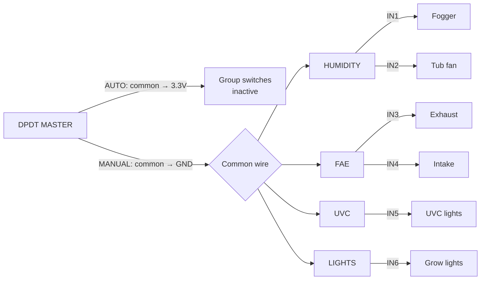
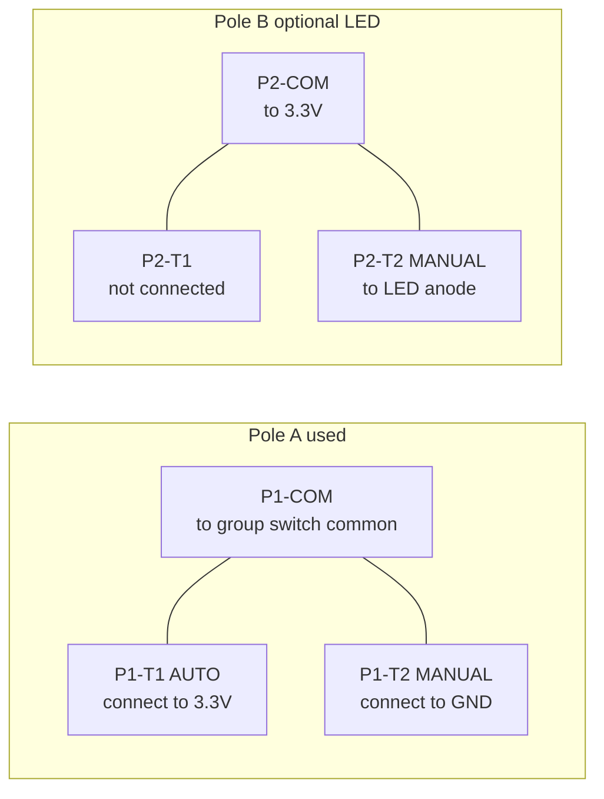

# Chapter 07 — Failsafe Panel Switches

**What you'll do:** Install the 5 panel switches in the lid, wire the DPDT master
switch and four SPST group switches, and verify the AUTO/MANUAL topology.

**Prerequisites:** Chapter 04 complete (relay board with pull-up resistors mounted).
5 panel switches (1× DPDT, 4× SPST), 22 AWG wire, soldering iron or ferrule crimper.

> [!NOTE]
> All wiring here is low-voltage (3.3V and GND). No mains voltage. Keep the
> enclosure unplugged.

---

## What the Failsafe Panel Does

The ESP32 is a computer — it can crash, lose WiFi, or get stuck. The failsafe panel
lets you run any load group manually, independently of the ESP32, by flipping the
master switch to MANUAL and using the group switches.

<strong>[?] AUTO vs MANUAL:</strong>

**AUTO** (normal operation): The DPDT master connects the group switches' common
wire to 3.3V (VCC). Closing a group switch can only push an IN pin toward 3.3V,
which is already its pulled-up resting state — no effect. The ESP32 controls
everything.

**MANUAL**: The DPDT master connects the common wire to GND. Closing a group
switch now pulls the corresponding relay IN pins to GND, firing those relays.
The 10 kΩ pull-up resistors limit current while allowing the GND to win.

The ESP32 GPIOs remain connected to the relay IN pins in both modes. In MANUAL
mode, flip the master first, then use group switches for load control.

---

## The Wiring Topology

ESP32 GPIOs remain connected to IN1–IN8 in both modes — the pull-up resistors
ensure a safe default when neither source is actively driving an IN pin.

---

## Step 1 — Install All 5 Switches

1. Thread each switch body through its lid hole from outside.
2. Thread the mounting nut on from inside and tighten firmly with needle-nose pliers.
   Firm enough that the switch won't rotate; not so tight you crack the plastic.

<strong>[?] DPDT switch:</strong>

Double Pole Double Throw — 6 terminals. Two independent
switching poles (A and B), each with a common and two throw positions. When the
lever moves, both poles switch simultaneously.

<strong>[?] SPST switch:</strong>

Single Pole Single Throw — 2 terminals. A simple gate.
When ON, the terminals connect. When OFF, they're open.

---

## Step 2 — Wire the DPDT Master Switch

Identify the 6 terminals (common layout — verify against your switch datasheet):

**Wire Pole A (essential):**

| Terminal | Connect to |
|----------|-----------|
| P1-COM | Short wire to junction node (this becomes the "common wire" for all SPST switches) |
| P1-T1 (AUTO position) | ESP32 `3V3` |
| P1-T2 (MANUAL position) | ESP32 GND |

Confirm AUTO vs MANUAL throw with a multimeter in continuity mode before soldering.

**Pole B (optional LED indicator):**

If you want a panel LED that lights when MANUAL is active:
- P2-COM → 3.3V
- P2-T2 (MANUAL throw) → LED anode (LED cathode via 1 kΩ series resistor → GND)
- P2-T1 → unconnected

Leave Pole B unconnected if skipping the indicator.

**✓ Check:** DPDT in AUTO — continuity between COM and 3V3 side. DPDT in MANUAL —
continuity between COM and GND side.

---

## Step 3 — Wire the SPST Group Switches

Each SPST has 2 terminals:
- Terminal 1: DPDT common wire junction
- Terminal 2: the relay IN pin(s) it controls

| Switch | Terminal 2 connects to |
|--------|----------------------|
| HUMIDITY | Relay `IN1` (fogger) **and** `IN2` (tub fan) |
| FAE | Relay `IN3` (exhaust) **and** `IN4` (intake) |
| UVC | Relay `IN5` |
| LIGHTS | Relay `IN6` |

For switches that control two IN pins (HUMIDITY, FAE): from the switch terminal,
run to a Wago 221 connector or twisted junction, then separate wires to each IN pin.

Leave enough wire slack for the lid to open fully without pulling on any connection.

---

## Step 4 — Verify Failsafe Wiring

**Test 1 — AUTO mode:**
1. Set DPDT to AUTO.
2. Close HUMIDITY switch.
3. Multimeter continuity between IN1 and GND: **no continuity** (switch connects
   IN1 to 3V3, not GND).
4. Repeat for all other IN pins: all open.

**Test 2 — MANUAL mode:**
1. Set DPDT to MANUAL.
2. Group switches all open: IN1–IN6 all show no continuity to GND.
3. Close HUMIDITY: IN1 and IN2 show continuity to GND. Others do not.
4. Open HUMIDITY: IN1 and IN2 return to no-continuity.
5. Repeat for FAE (IN3+IN4), UVC (IN5), LIGHTS (IN6).

**✓ Check:** All 8 test conditions pass. MANUAL mode enables each group switch for
exactly its assigned IN pins. AUTO mode makes all group switches inoperative.

---

## Chapter 07 Checkpoint

- [ ] All 5 switches installed in lid with mounting nuts secure
- [ ] DPDT: COM → common wire node; T1 (AUTO) → 3V3; T2 (MANUAL) → GND
- [ ] HUMIDITY switch: common wire → IN1 and IN2
- [ ] FAE switch: common wire → IN3 and IN4
- [ ] UVC switch: common wire → IN5
- [ ] LIGHTS switch: common wire → IN6
- [ ] Sufficient wire slack for lid to open fully
- [ ] Test 1 passed: AUTO mode — group switches have no effect on IN pins
- [ ] Test 2 passed: MANUAL mode — each group switch activates correct IN pins only

---

[← Ch 06 — Sensor Wiring](06-sensor-wiring.md)  ·  [Ch 08 — Low-Voltage Signal Wiring →](08-signal-wiring.md)
