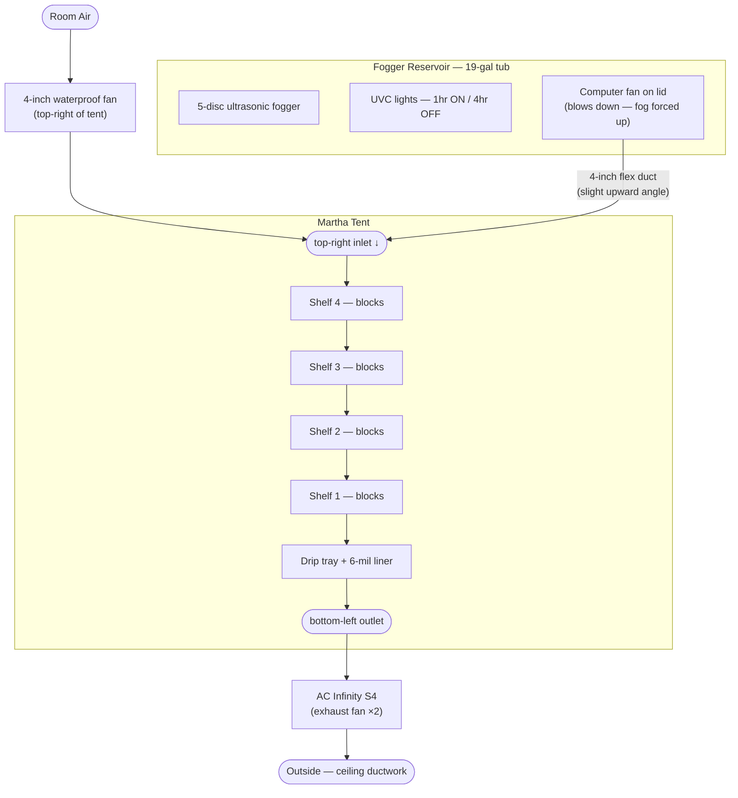
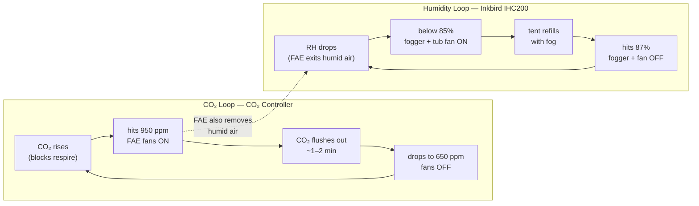

# u/dccrens' Automated Martha Tent Build Guide

> **Credit:** This guide is a detailed writeup of the build shared by u/dccrens on r/MushroomGrowers in January 2022 (274 upvotes). All specs, tips, and hard-won lessons come directly from dccrens — this document exists to make that knowledge easier to find and follow.
>
> Original post: https://www.reddit.com/r/MushroomGrowers/comments/sbnlib/gourmet_marth_2_dot_o_is_up_and_running_much/

**→ [Shopping List](https://aes87.github.io/automated-martha-tek/martha-tent-build/martha-tent-shopping-list.html)** — interactive checklist with persistent notes, syncs to your GitHub account.

## Contents

- [What You're Building](#what-youre-building)
- [How the System Works](#how-the-system-works)
- [Parts List](#parts-list)
  - [Tent](#tent)
  - [CO2 Controller](#co2-controller-fae-automation)
  - [Humidity Controller](#humidity-controller)
  - [Fogger / Humidity System](#fogger--humidity-system)
  - [FAE Fans](#fae-fans)
  - [Ducting](#ducting)
  - [Drip Tray / Floor](#drip-tray--floor)
  - [Lighting & Misc](#lighting--misc)
- [Assembly](#assembly)
- [Cost Summary](#cost-summary)
- [Environmental Targets](#environmental-targets)
- [Ongoing Maintenance](#ongoing-maintenance)
- [Key Lessons](#key-lessons-hard-won-by-dccrens)

---

## What You're Building

A fully automated Martha-style fruiting chamber that handles humidity and CO2 without you having to think about it. Once dialed in, maintenance is about 10 minutes a week (top off water, check discs). The tent holds 80–95% RH and keeps CO2 in an optimal range for gourmet mushrooms automatically.

**The core idea:**
- A CO2 controller triggers FAE fans whenever CO2 climbs too high
- A humidity controller triggers the fogger whenever RH drops too low
- These two systems chase each other in a stable cycle — you set them and mostly forget them
- Everything is modular so you can break it down and clean it every couple of months

This is version 2 of dccrens' build. Version 1 rusted out. The single biggest lesson learned: **paint all metal before assembly.**

---

## How the System Works

Air and humidity enter from the **top-right** of the tent. CO2-rich air exhausts from the **bottom-left**. This cross-flow pattern means fresh humid air sweeps down through all the shelves before exiting — efficient and uniform.

**What happens in a cycle:**
1. CO2 climbs as blocks respire → hits 950 ppm → both FAE fans kick on
2. Fans run ~1–2 min, flush CO2 out → CO2 drops to 650 ppm → fans stop
3. FAE also drops the RH slightly as humid air exits → IHC200 detects drop below 85%
4. Fogger + tub fan kick on → refills tent with humid air
5. Repeat indefinitely. dccrens reports RH averaging ~87%, ranging 80–95%.

---

> **⚠️ Before you start:** Every metal pole and shelf must be painted before assembly — 3 coats of Rustoleum, fully dry. There is no fixing this after the tent is assembled. Skipping this step is what destroyed v1 and necessitated v2.

## Parts List

### Tent

| Item | Where | ASIN / Notes |
|------|-------|--------------|
| Greenhouse shelving tent | Amazon | [B07TSC1MB3](https://www.amazon.com/dp/B07TSC1MB3) — $63.99 |

**Before you assemble:** spray every metal pole and shelf with **3 coats of Rustoleum** (hunter green or any color). The tent will rust otherwise — this is how v1 died. Paint it *new*, not after rust appears. The shelves hold 3 fruiting blocks (~8 lb each) without issues.

---

### CO2 Controller (FAE automation)

| Item | Where | ASIN / Notes |
|------|-------|--------------|
| CO2 controller | Amazon | [B08HQMBQ79](https://www.amazon.com/dp/B08HQMBQ79) — $161.01 |

**Setup:**
1. Switch to **Human mode** (not Plant mode — mushrooms respire like animals, not plants)
2. Set your altitude
3. Set **Center = 800**, **Zone = 300**
   - This gives you: **On at 950 ppm / Off at 650 ppm**
   - Formula: On = Center + (Zone ÷ 2) ; Off = Center − (Zone ÷ 2)

The controller powers both the exhaust fan and the intake fan simultaneously on the same switched outlet.

> **Budget option:** dccrens ran for a full year using a simple outlet timer + a cheap CO2 meter before buying the controller. Use the meter to observe your natural CO2 levels and flush frequency, then set the timer to match. The controller is more precise and hands-off, but it's not the only path.

---

### Humidity Controller

| Item | Where | ASIN / Notes |
|------|-------|--------------|
| Inkbird IHC200 Humidistat | Amazon | [B07XGQ7Q53](https://www.amazon.com/dp/B07XGQ7Q53) — $41.99 |
| Inkbird IBS-TH2 Plus (data logger) | Amazon | [B095W39L4M](https://www.amazon.com/dp/B095W39L4M) — ~$30 |

**IHC200 settings:** 85% RH, 2% offset (so it kicks on below 85%, kicks off at 87%).

The IHC200 controls **both the fogger and the tub fan on the same outlet**. They always run together.

The IBS-TH2 Plus is for verification — not for control. dccrens found that top, middle, and bottom of the tent all read within 1% RH of each other, confirming the fogger fills the tent uniformly. It logs data to your phone via the free Inkbird app.

---

### Fogger / Humidity System

| Item | Where | Notes |
|------|-------|-------|
| House of Hydro 5-disc ultrasonic fogger | [thehouseofhydro.com](https://thehouseofhydro.com/) | Round unit with float; extra discs included free |
| 19-gallon tub (black/yellow, locking lid) | Hardware store | No gasket needed; the lid doesn't need to seal |
| Aquarium-grade UVC lights | Amazon / pet store | Mounted inside the tub |
| Outlet timer (for UVC) | Amazon | Set to 1 hr ON / 4 hr OFF |
| 4" computer fan (waterproof) | Amazon | Mounts on top of tub lid, blows *down* into tub |
| H₂O₂ (hydrogen peroxide) | Pharmacy | Standard 3% bottle, ~$1–2 |

**Water:** Use **tap water, not distilled.** Ultrasonic foggers atomize water by vibrating at high frequency — they rely on the mineral content in tap water. Distilled water can actually damage them.

**Consumption:** About 5 gallons every 3–4 days.

**UVC note:** Run the UVC lights on a timer (1 hr on / 4 hr off), not 24/7 — continuous use shortens bulb life unnecessarily.

**Disc maintenance:** Watch fog volume. When output drops, swap the discs for the clean set (included) and soak the dirty ones. dccrens ran the same fogger for 1+ year without needing disc replacement.

**Mold prevention — 1-2 punch:**
1. Pour one bottle of H₂O₂ into the tank weekly
2. UVC lights kill algae and mold in the water on their cycle

---

### FAE Fans

| Item | Where | ASIN / Notes |
|------|-------|--------------|
| AC Infinity CLOUDLINE S4 (4" inline, quiet) | Amazon | ~$99 — buy **two** |
| 4" waterproof computer fan (intake) | Amazon | Any waterproof 4" PC fan |

The **S4 exhaust fan** mounts at the bottom-left of the tent. It vents via 4" flex duct up through the ceiling into existing HVAC ductwork and out of the house. Both are controlled by the CO2 controller.

The **intake computer fan** mounts at the top-right, next to the fogger inlet. It pulls fresh air from the room the Martha is in.

**Buy two exhaust fans.** When it's time to clean, swap the dirty one out for the spare and keep the grow running uninterrupted.

---

### Ducting

| Item | Notes |
|------|-------|
| 4" flexible silver duct (flex pipe) | Right side: fogger tub → tent. Left side: tent → ceiling ductwork |
| 4" galvanized adjustable elbow | Sits at the top of the fogger flex pipe |
| Custom inlet adapter | Flat piece of hard plastic screwed to the Martha frame with a 4" hole cut in it. The elbow press-fits into it — cut the hole just tight enough to hold |

**Critical detail on the fogger inlet angle:** The elbow at the top of the fog pipe should enter the tent at a **slight upward angle** — not quite level. Any condensation that forms in the pipe will flow *back down* into the tank rather than pooling. dccrens reports zero water pooling with this setup.

---

### Drip Tray / Floor

| Item | Where | ASIN / Notes |
|------|-------|--------------|
| Commercial drip tray | Amazon | [B0002NNWDW](https://www.amazon.com/dp/B0002NNWDW) — 41.3 × 27.75 × 1 inch |
| 6-mil plastic sheeting | Hardware store | Cut to size; fold corners to create a 1" lip |

Lay the tray on the bottom wire shelf. Cut 6-mil plastic to fit inside it with a 1" folded lip at the corners — this creates a waterproof liner. Velcro it in place.

**No perlite.** It's not needed when you're pumping fog in from outside. Perlite inside the tent just creates another surface for mold to colonize.

---

### Lighting & Misc

| Item | Notes |
|------|-------|
| LED strips | Mounted inside the tent (upgraded from v1) |
| Rustoleum spray paint | Hunter green; 3 coats on all metal before assembly |
| Velcro | Use everywhere instead of zip ties or glue — modularity is the whole point |

---

## Assembly

With all parts in hand, assemble in this order.

### 1. Paint first

Spray every metal pole and shelf with 3 coats of Rustoleum before you assemble anything. Let it dry fully between coats. There is no fixing this after assembly.

### 2. Assemble the tent

Follow the manufacturer instructions. Set it up in its final location — adding ducting afterward makes moving it awkward.

### 3. Install the drip tray

Place the commercial drip tray on the bottom wire shelf. Cut 6-mil plastic sheeting to fit inside it with 1" folded corners to create a waterproof liner. Velcro it in place.

### 4. Set up the fogger reservoir

Fill the tub with tap water. Place the fogger inside. Mount the UVC lights inside the tub. Mount the 4" computer fan on the lid so it blows *down* — this forces fog up and out through the duct. Connect the UVC lights to the outlet timer (1hr ON / 4hr OFF). Connect the fogger and tub fan to the IHC200 outlet — they always run together.

### 5. Run the fogger duct

Screw a flat piece of hard plastic to the tent frame at the top-right and cut a 4" hole in it — this is the inlet adapter. Press-fit the galvanized elbow into the adapter. Run 4" flex duct from the fogger tub up to the elbow. **The duct must enter at a slight upward angle** — condensation drains back down to the tank. Any downward slope pools water at the inlet.

[Inlet adapter reference](https://imgur.com/a/vnFbMfp) *(external photo, may not persist)*

### 6. Mount the fans

- **Exhaust (bottom-left of tent):** Mount the AC Infinity S4 pulling air *out*. Run 4" flex duct from the fan to ceiling ductwork and out of the house. Connect to the CO2 controller outlet.
- **Intake (top-right of tent):** Mount the 4" waterproof computer fan pulling room air *in*, next to the fogger inlet. Connect to the same CO2 controller outlet — both fans run together.

### 7. Position the sensor probes

Mount both controllers outside the tent and route their probes inside:

- **CO2 controller probe:** mid-height inside the tent, away from the direct fogger airstream
- **IHC200 probe:** mid-height inside the tent; RH is uniform within ~1% top-to-bottom, so height matters less than keeping it out of the direct fog blast
- **IBS-TH2 Plus:** place anywhere inside the tent for independent data logging

### 8. Configure and test

Configure the controllers per the [CO2 Controller](#co2-controller-fae-automation) and [Humidity Controller](#humidity-controller) settings in the Parts List above. Run the system empty for a few hours to verify both control loops cycle correctly and confirm no water pools at the fogger inlet.

---

## Cost Summary

**Rough total: ~$250 USD** (circa 2022 prices — current pricing will differ). See the [Shopping List](https://aes87.github.io/automated-martha-tek/martha-tent-build/martha-tent-shopping-list.html) for up-to-date links and prices.

The CO2 controller ($161 in 2022) and two AC Infinity S4 fans (~$99 each) are the main costs. The tub, fogger, ducting, velcro, and paint are comparatively cheap.

If you want to reduce upfront cost, run a timer and a cheap CO2 meter for the first year — as dccrens did — and buy the CO2 controller once you know the build works for you.

---

## Environmental Targets

| Parameter | Setting | Actual range |
|-----------|---------|-------------|
| RH setpoint | 85% (±2%) | 80–95%, avg ~87% |
| CO2 fan-on | 950 ppm | — |
| CO2 fan-off | 650 ppm | — |
| FAE cycle duration | — | ~1–2 min |

**Species-specific CO2 guidance (per dccrens):**

| Species type | Recommended range |
|--------------|-------------------|
| Gourmet mushrooms | 400–800 ppm |
| Actives (psilocybin) | 500–900 ppm |

The 650–950 ppm controller setting keeps gourmet mushrooms in good shape — they spend most of their time in the 650–800 ppm range between cycles.

---

## Ongoing Maintenance

**Weekly:**
- Pour one pharmacy bottle of H₂O₂ into the fogger tank
- Top off the tank (~5 gallons every 3–4 days, so adjust as needed)
- Check fog output — if it's dropping, swap the fogger discs for the clean set

**Every ~2 months:**
- Full teardown and cleaning of the Martha
- Spray all surfaces with H₂O₂, wipe down
- Swap the exhaust fan (pull the dirty one, run the spare, clean the dirty one for next time)
- This is why everything is velcroed and modular — the whole thing should come apart easily

---

## Key Lessons (Hard-Won by dccrens)

1. **Paint before assembly.** 3 coats Rustoleum on every metal part, before you put it together. This is why v2 exists.
2. **No perlite.** Not needed. It just holds moisture and invites mold.
3. **No PVC fog distribution pipes.** Fog is denser than air — it fills the tent uniformly from a single top-right inlet. PVC pipes trap water in the bends and become mold reservoirs. The person who had them said: "If I did it again I would just pipe the fog directly to the top and let it diffuse on its own. Simpler is better."
4. **Velcro everything.** Not zip ties, not glue. You will be breaking this down to clean it.
5. **Buy two exhaust fans.** Swap them out. Don't stop your grow to clean a fan.
6. **Upward angle on the fogger inlet.** Condensation drains back to the tank. No pooling.
7. **Tap water in the fogger.** Ultrasonic foggers need the minerals in tap water. Don't use distilled.
8. **H₂O₂ + UVC is your 1-2 punch against mold/algae in the water.** Both are cheap. Both work.
9. **Cross-flow airflow matters.** Humid air in top-right, CO2 out bottom-left. This sweeps cleanly through every shelf.
10. **A timer is a valid starting point.** Watch your CO2 with a cheap meter, set a timer based on what you observe, and upgrade to a controller when you're ready.
